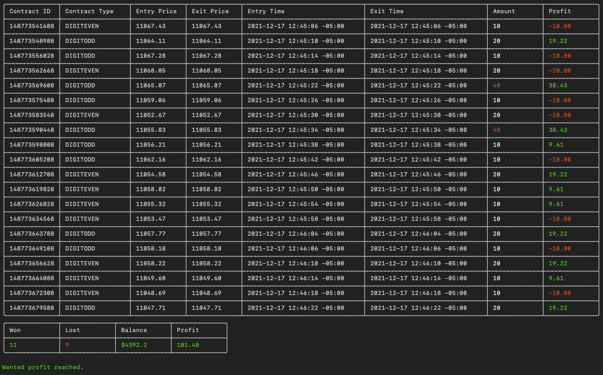

# Binarycr

Trading bot for Binary.com

## Installation

```crystal
crystal build src/binarycr.cr --release
```

## Parameters
`--token=xxx` Is your Token from `binary.com` <br>
`--application=xxx` Is your APP number from `binary.com` <br>
`--duration=1` That is the number of ticks to wait between trades <br>
`--trade_amount=1`   Amount of dollars on each trade <br>
`--wanted_profit=10`  Profit to take and close the trading session <br>
`--stop_loss=8`     Stop loss, trading session will end at the specified consecutive loss <br>
`--contract=even` Type of contract to trade `even`, `odd` and `both` ( both will alternate between even and odd) <br>
`--show_notification=true` It will show a notification alert when the trading session ends but ONLY for a MacOS computer

To exit a trading session you must hit CTRL + C to end the program. <br>

## Usage

It will alternate between Contract Types, EVEN and ODD
```bash
./binarycr --token=xxx --application=xxx --duration=1 --trade_amount=10 --wanted_profit=100 --stop_loss=8 --contract=both
```

To only place trades in EVEN or ODD you can set it in the --contract parameter for `even` or `odd`
```bash
./binarycr --token=xxx --application=xxx --duration=1 --trade_amount=10 --wanted_profit=100 --stop_loss=8 --contract=even
```

To display the account balance
```bash
./binarycr --token=xxx --application=xxx --balance
```

## Screenshots

Example of a winning trading session



## Contributing

1. Fork it (<https://github.com/xtokio/binarycr/fork>)
2. Create your feature branch (`git checkout -b my-new-feature`)
3. Commit your changes (`git commit -am 'Add some feature'`)
4. Push to the branch (`git push origin my-new-feature`)
5. Create a new Pull Request

## Contributors

- [Luis Gomez](https://github.com/xtokio) - creator and maintainer
